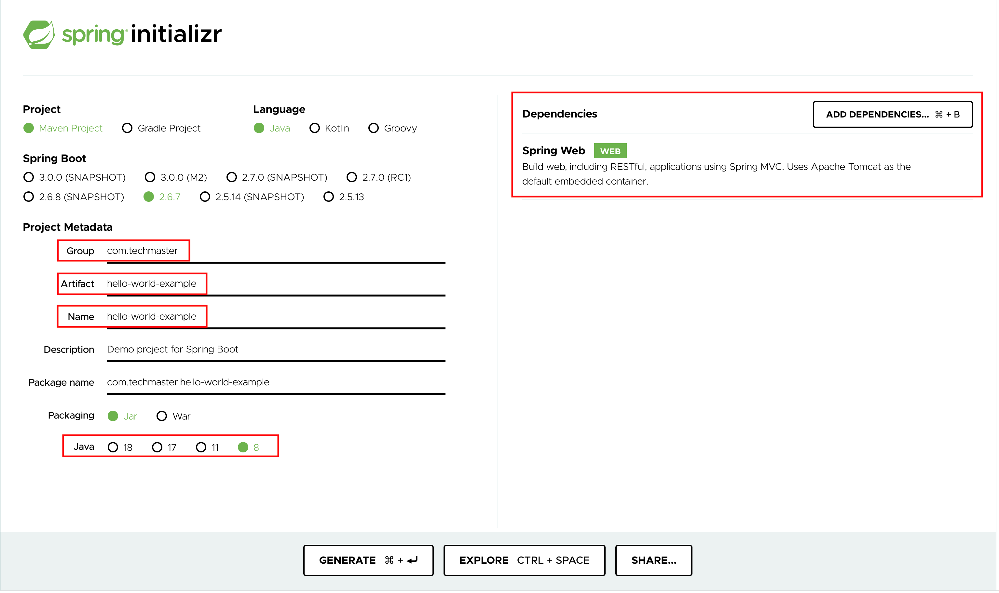

Example containerized java spring boot project
---


### Step 1. Generate java spring boot project
Click here to open generate page: https://start.spring.io


### Step 2. Upate hello world code
Edit file in `src/main/com/techmaster/helloworldexample`
```java
package com.techmaster.helloworldexample;

import org.springframework.boot.SpringApplication;
import org.springframework.boot.autoconfigure.SpringBootApplication;
import org.springframework.web.bind.annotation.RequestMapping;
import org.springframework.web.bind.annotation.RestController;

@SpringBootApplication
@RestController
public class HelloWorldExampleApplication {

	@RequestMapping("/")
    public String home() {
        return "Hello Docker World";
    }

	public static void main(String[] args) {
		SpringApplication.run(HelloWorldExampleApplication.class, args);
	}

}
```

### Step 3. Build application
```bash
chmod +x ./mvnw
mvnw package
```

### Step 4. Run application
```bash
java -jar target/hello-world-example-0.0.1-SNAPSHOT.jar
```


# How Maven works?
These are the default life cycle phases in maven

- **validate** - validate the project is correct and all necessary information is available
- **compile** - compile the source code of the project
- **test** - test the compiled source code using a suitable unit testing framework. These tests should not require the code be packaged or deployed
package - take the compiled code and package it in its distributable format, such as a JAR.
- **verify** - run any checks on results of integration tests to ensure quality criteria are met
- **install** - install the package into the local repository, for use as a dependency in other projects locally
- **deploy** - done in the build environment, copies the final package to the remote repository for sharing with other developers and projects.


### Understand
order of execution
```
validate >> compile >> test (optional) >> package >> verify >> install >> deploy
```

So when you run the command `mvn package`, it runs the commands for all lifecycle phases till package
```
validate >> compile >> test (optional) >> package
```

And as for `mvn install`, it runs the commands for all lifecycle phases till install, which includes package as well
```
validate >> compile >> test (optional) >> package >> verify >> install
```


